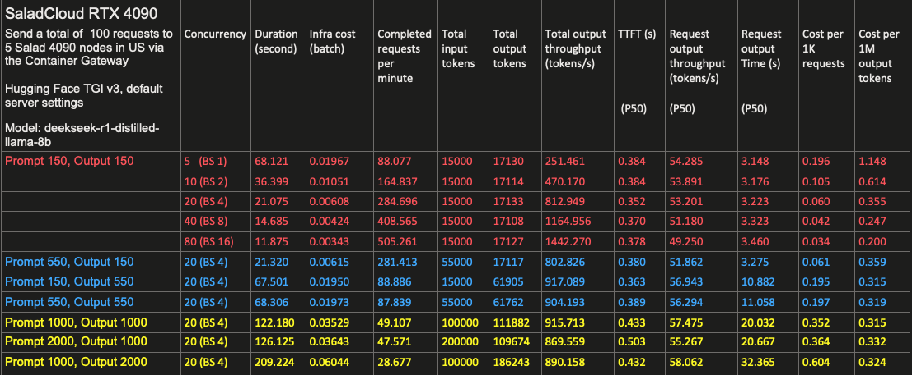
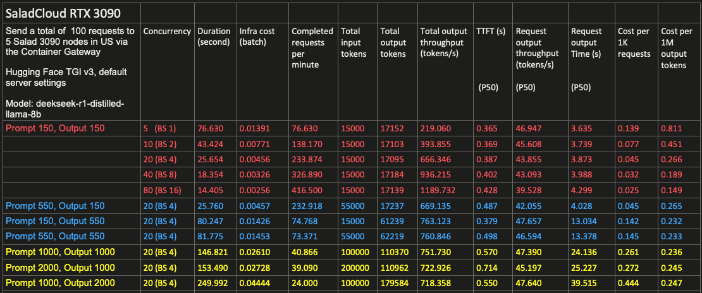

# DeepSeek TGI Benchmark on SaladCloud

This repository provides code, configurations and benchmark results on SaladCloud.

Model: [DeepSeek-R1-Distill-Llama-8B](https://huggingface.co/deepseek-ai/DeepSeek-R1-Distill-Llama-8B)

Inference Server: [Hugging Face's TGI v3](https://huggingface.co/docs/text-generation-inference/en/index)

Two SCE container groups created on SaladCloud:
- 5 x 4090 in the US, with SaladCloud's Container Gateway
- 5 x 3090 in the US, with SaladCloud's Container Gateway

Benchmark Tool: [LLMPerf](https://github.com/ray-project/llmperf)

### [Benchmark Results and Observations]

TGI utilizes a continuous batching algorithm, dynamically adding requests to the running batch for optimal performance. As the number of concurrent requests increases from 5 to 10, 20, 40, and 80 for both the two 5-replica container groups, the total output throughput improves by over 500% while the cost per 1M output tokens drops by more than 80%. However, both per-request output throughput and time degrade as the number of concurrent requests rises.

As input prompt length increases, TTFT also rises. However, network transmission, along with queuing within TGI, remains the primary source of latency, which is approximately 300 milliseconds.

TTFT constitutes a small portion of the total request-output time, which is primarily influenced by the output length (number of generated tokens). Enabling token streaming allows tokens to be returned one by one, significantly reducing the wait time for the complete response and enhancing the user experience.

Larger batch sizes and longer context lengths (input prompt + generated text) lead to higher VRAM usage. Both RTX 3090 and RTX 4090 feature 24GB of VRAM and can handle batched inference with an 8B LLM model in 16-bit precision as follows:
- A batch size of 16 and a context length of 1024
- A batch size of 8 and a context length of 2048
- A batch size of 4 and a context length of 4096
- A batch size of 1 and a context length of 16384

For more information on LLM VRAM usage, please check [this link](https://docs.salad.com/guides/llm/llm-general#vram-usage).

The RTX 4090 delivers over 20% higher performance than the RTX 3090, but comes at a 40% higher cost. The RTX 3090 remains a strong option for certain LLM use cases, thanks to its excellent price-to-performance ratio and per-request output throughput exceeding 40 tokens per second.

Please see [the original samples](https://github.com/SaladTechnologies/llm_ben/tree/main/result_outputs) generated by LLMPerf during the benchmarking test.

### [The container image](https://github.com/huggingface/text-generation-inference/blob/main/Dockerfile)

In this benchmark, the container gateway will be deployed to manage access. The benchmarking image is built on the official TGI image, includes testing tools and performs an initial check (VRAM, CUDA version) before starting the TGI server.

### [Deployment on SaladCloud](https://github.com/SaladTechnologies/llm_ben/tree/main/saladcloud_deployment)

The example code creates two separate container groups using the SaladCloud Python SDK, one for the RTX 3090 and the other for the RTX 4090, each group consisting of 5 replicas. 

### [Benchmarking tool and methodology](https://github.com/ray-project/llmperf)

Each LLM model uses its own tokenizer, meaning the same prompt may result in different token counts across models. To maintain consistency and comparability, LLMPerf standardizes token counting by using the LlamaTokenizer for both input and output tokens, regardless of the model being tested. For more information, refer to [the additional details](https://github.com/SaladTechnologies/llm_ben/blob/main/metrics_explained.txt) about the benchmarking samples generated by LLMPerf.

We have updated [the benchmark code](https://github.com/SaladTechnologies/llm_ben/blob/main/token_benchmark_ray.py#L280) to include additional metrics based on [SaladCloud pricing](https://salad.com/pricing), such as infrastructure cost, cost per 1K requests and cost per 1M output tokens.

For this benchmarking test, we send concurrent requests to the two container groups (the RTX 3090 and the RTX 4090), varying the number of concurrent requests and combinations of prompt and output lengths, and then collect the results. Metrics like TTFT and E2E Latency are also affected by the distance from the gateway to the client location, which, in this test, is California.

